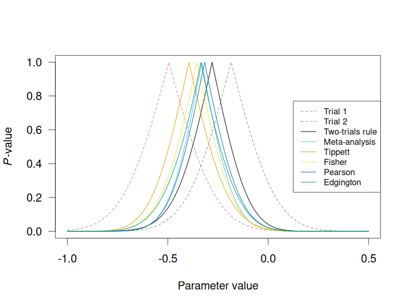

# twotrials

The **twotrials** R package implements combined *p*-value functions for two
trials along with compatible combined point and interval estimates. The
theoretical background of the package is described in

> Pawel, S., Roos, M., Held. L. (2025). Combined *P*-value Functions for Compatible Effect Estimation and Hypothesis Testing in Drug Regulation. <https://github.com/SamCH93/twotrials>

## Installation

```r
## CRAN version
## install.packages("twotrials") # not on CRAN yet

## from GitHub
## install.packages("remotes") # requires remotes package
remotes::install_github(repo = "SamCH93/twotrials", subdir = "package")
```

## Usage 

The **twotrials** package provides six different *p*-value combination method
based on which combined *p*-values, parameter estimates, and confidence
intervals can be computed. For each method, there is a combined *p*-value
function (e.g., `pEdgington`) and a combined estimation function (e.g.,
`muEdgington`). While these can be used to manually compute *p*-values and
parameter estimates, the convenience function `twotrials` automatically computes
estimates and *p*-values based on all methods, and allows for easy printing and
plotting of the results. The following code chunk illustrates its usage

```r
library(twotrials) # load package

## combine logRR estimates from RESPIRE trials
results <- twotrials(null = 0, t1 = -0.4942, t2 = -0.1847, se1 = 0.1833,
                     se2 = 0.1738, alternative = "less", level = 0.95)
print(results, digits = 2) # print summary of results

#> INDIVIDUAL RESULTS
#>    Trial Lower CI Estimate Upper CI P-value
#>  Trial 1    -0.85    -0.49    -0.13  0.0035
#>  Trial 2    -0.53    -0.18     0.16  0.1440
#> 
#> COMBINED RESULTS
#>           Method Lower CI Estimate Upper CI P-value
#>  Two-trials rule    -0.57    -0.28   -0.011  0.0207
#>    Meta-analysis    -0.58    -0.33   -0.084  0.0043
#>          Tippett    -0.68    -0.39   -0.084  0.0070
#>           Fisher    -0.64    -0.35   -0.087  0.0043
#>          Pearson    -0.58    -0.32   -0.044  0.0114
#>        Edgington    -0.64    -0.34   -0.048  0.0109
#> 
#> NOTES 
#> Confidence level: 95%
#> Null value: 0
#> Alternative: less

plot(results, xlim = c(-1, 0.5), two.sided = TRUE) # plot p-value functions
```


<!-- png(filename = "twotrials.png", width = 1*800, height = 1*600, pointsize = 22); plot(results, xlim = c(-1, 0.5), two.sided = TRUE); dev.off() -->
